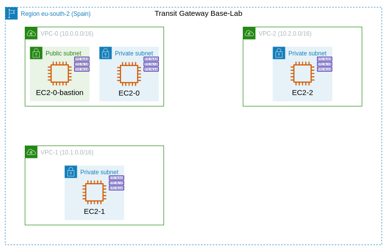
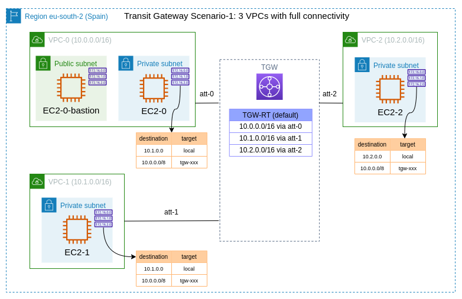
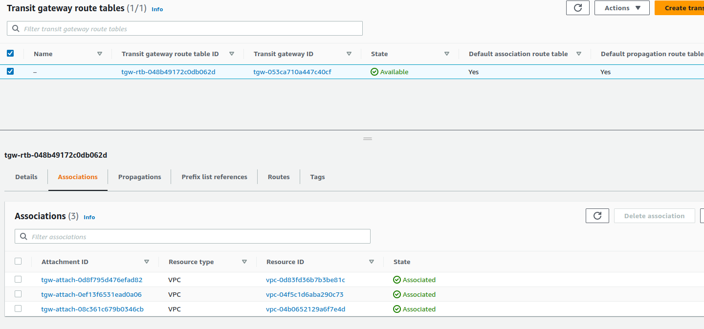
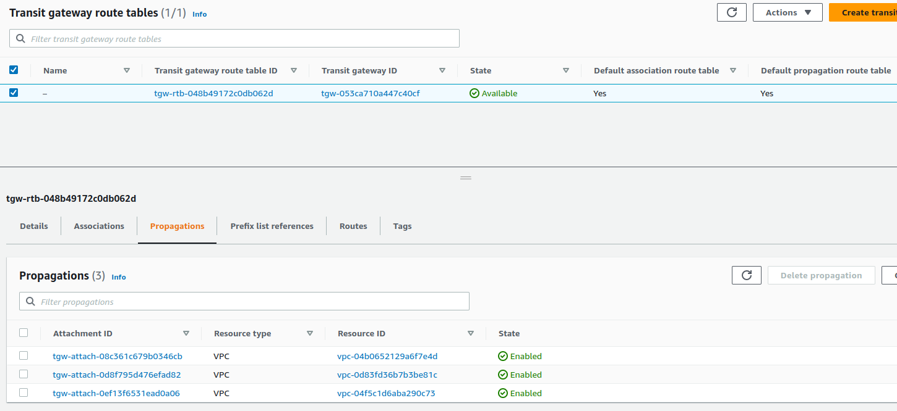
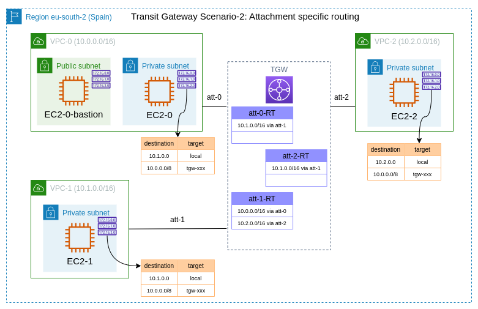

# Testing AWS Transit Gateway in Spain with Terraform
After seeing the [AWS latest News](https://aws.amazon.com/es/about-aws/whats-new/2023/04/aws-transit-gateway-europe-spain-region/) that said "AWS Transit Gateway is now available in Europe (Spain) Region (eu-south-2)" the last April 14, 2023, i decided to test the service with Terraform, just for fun...

## Base Lab
First we need to create the infrastructure base, wich consists of 3 VPCs and corresponding private subnets. In case VPC-0 we've added also a public subnet, becasue we need for bastion host (EC2-0-bastion), we reach it via SSM.



After terraform apply in [base-lab](base-lab) directory, we can get output to connect to bastion host:

```bash
➜  base-lab git:(main) ✗ TF_WORKSPACE=spain terraform apply -var-file=spain.tfvars
data.aws_iam_policy.this: Reading...
data.aws_iam_policy_document.this: Reading...
...
...
Apply complete! Resources: 76 added, 0 changed, 0 destroyed.

Outputs:

connect_bastion = "aws ssm start-session --target i-09b923594e90956b8 --region eu-south-2 --profile toninoes-aws2"
ip_ec2_vpc_0 = "10.0.1.71"
ip_ec2_vpc_1 = "10.1.1.40"
ip_ec2_vpc_2 = "10.2.1.10"
```
we can connect via SSM to bastion with:
```bash
➜  base-lab git:(main) ✗ aws ssm start-session --target i-09b923594e90956b8 --region eu-south-2 --profile toninoes-aws2

Starting session with SessionId: Toni-09ca128511bc6426f
sh-5.2$ 
```
We need to test connectivity then, from EC2 instances in privates subnets obiously, they can reach at the moment.
Let's jump to EC2-0, first we need to copy private key in EC2-0-bastion.

```
sh-5.2$ echo "your_private_key_content" > tgw-lab.pem
sh-5.2$ 
sh-5.2$ chmod 400 tgw-lab.pem 
sh-5.2$ 
sh-5.2$ ssh -i tgw-lab.pem ec2-user@10.0.1.71
   ,     #_
   ~\_  ####_        Amazon Linux 2023
  ~~  \_#####\
  ~~     \###|
  ~~       \#/ ___   https://aws.amazon.com/linux/amazon-linux-2023
   ~~       V~' '->
    ~~~         /
      ~~._.   _/
         _/ _/
       _/m/'

```

...and then, of course we can't ping to EC2-1 or EC2-2

```
[ec2-user@ip-10-0-1-71 ~]$ ping 10.1.1.40
PING 10.1.1.40 (10.1.1.40) 56(84) bytes of data.
^C
--- 10.1.1.40 ping statistics ---
4 packets transmitted, 0 received, 100% packet loss, time 3156ms

[ec2-user@ip-10-0-1-71 ~]$ ping 10.2.1.10
PING 10.2.1.10 (10.2.1.10) 56(84) bytes of data.
^C
--- 10.2.1.10 ping statistics ---
3 packets transmitted, 0 received, 100% packet loss, time 2066ms

```
Let's create our first Transit gateway in the next step.

## Scenario 1: Transit Gateway with three VPCs with full connectivity
In this first scenario, we'll create full connectivity between all our privates subnets of 3 VPCs. 



For this, apply our terraform configuration in [transit-gateway-scenario-1](transit-gateway-scenario-1) folder:

In this scenario, we'll enable route table association and default route table propagation.

```terraform
resource "aws_ec2_transit_gateway" "this" {
  default_route_table_association = "enable"
  default_route_table_propagation = "enable"
  description = "My beginner transit-gateway in spain"

  tags = {
    "Name" = "TGW-with-RT-association-propagation"
  }
}
```
Then, create 3 Transit Gateway VPC attachments for each VPC
```terraform
resource "aws_ec2_transit_gateway_vpc_attachment" "this" {
  count = var.vpc_number

  subnet_ids         = data.aws_subnets.private[count.index].ids
  transit_gateway_id = aws_ec2_transit_gateway.this.id
  vpc_id             = data.aws_vpc.this[count.index].id

  tags = {
    "Name" = "att-${count.index}"
  }
}
```
After this, we can see Associations... 

...and propagations automatically in our TGW:

But, after that, we cant reach other private subnets from EC2-0 instance, we need to modify all Private subnet route table and add route for 10.0.0.0/8 via the Transit gateway attachment.
```terraform
resource "aws_route" "route" {
  for_each = toset(data.aws_route_tables.this.ids)

  route_table_id         = each.key
  destination_cidr_block = "10.0.0.0/8"
  transit_gateway_id     = aws_ec2_transit_gateway.this.id
}
```
and after this:
```bash
[ec2-user@ip-10-0-1-71 ~]$ ping 10.1.1.40
PING 10.1.1.40 (10.1.1.40) 56(84) bytes of data.
64 bytes from 10.1.1.40: icmp_seq=1 ttl=126 time=0.483 ms
64 bytes from 10.1.1.40: icmp_seq=2 ttl=126 time=0.274 ms
64 bytes from 10.1.1.40: icmp_seq=3 ttl=126 time=0.266 ms
^C
--- 10.1.1.40 ping statistics ---
3 packets transmitted, 3 received, 0% packet loss, time 2089ms
rtt min/avg/max/mdev = 0.266/0.341/0.483/0.100 ms
[ec2-user@ip-10-0-1-71 ~]$ 
[ec2-user@ip-10-0-1-71 ~]$ 
[ec2-user@ip-10-0-1-71 ~]$ ping 10.2.1.10
PING 10.2.1.10 (10.2.1.10) 56(84) bytes of data.
64 bytes from 10.2.1.10: icmp_seq=1 ttl=126 time=0.479 ms
64 bytes from 10.2.1.10: icmp_seq=2 ttl=126 time=0.282 ms
64 bytes from 10.2.1.10: icmp_seq=3 ttl=126 time=0.261 ms
^C
--- 10.2.1.10 ping statistics ---
3 packets transmitted, 3 received, 0% packet loss, time 2081ms
rtt min/avg/max/mdev = 0.261/0.340/0.479/0.098 ms
```
Before to test the next scenario, destroy first with terraform destroy in the same directory.

## Scenario 2: Transit Gateway Attachments with specific routing
In the previous scenario all private subnets of all VPC can reach to each other, imagine we need specific connectivities, for example:

- VPC-0: Connects only with VPC-1
- VPC-1: Connects with VPC-0 and VPC-2
- VPC-2: Connects only with VPC-1



...in this case do not enable route table association and default route table propagation.

```terraform
resource "aws_ec2_transit_gateway" "this" {
  default_route_table_association = "disable"
  default_route_table_propagation = "disable"
  description = "My beginner transit-gateway in spain"

  tags = {
    "Name" = "TGW-without-RT-association-propagation"
  }
}
```
then create 3 Transit Gateway VPC attachments for each VPC
```terraform
resource "aws_ec2_transit_gateway_vpc_attachment" "this" {
  count = var.vpc_number

  subnet_ids         = data.aws_subnets.private[count.index].ids
  transit_gateway_default_route_table_association = false
  transit_gateway_default_route_table_propagation = false
  transit_gateway_id = aws_ec2_transit_gateway.this.id
  vpc_id             = data.aws_vpc.this[count.index].id


  tags = {
    "Name" = "att-${count.index}"
  }
}
```
Now, we cant see our TGW RT (default), we need create specific route table
```terraform
resource "aws_ec2_transit_gateway_route_table" "this" {
  count = var.vpc_number

  transit_gateway_id = aws_ec2_transit_gateway.this.id

  tags = { Name: "att-${count.index}-RT" }
}
```
...and associate with corresponding VPC attachments
```terraform
resource "aws_ec2_transit_gateway_route_table_association" "this" {
  count = var.vpc_number

  transit_gateway_attachment_id  = aws_ec2_transit_gateway_vpc_attachment.this[count.index].id
  transit_gateway_route_table_id = aws_ec2_transit_gateway_route_table.this[count.index].id
}
```
...and propagations
```terraform
resource "aws_ec2_transit_gateway_route_table_propagation" "vpc_0_to_vpc_1" {
  transit_gateway_route_table_id = aws_ec2_transit_gateway_route_table.this[0].id
  transit_gateway_attachment_id  = aws_ec2_transit_gateway_vpc_attachment.this[1].id
}

resource "aws_ec2_transit_gateway_route_table_propagation" "vpc_1_to_vpc_0" {
  transit_gateway_route_table_id = aws_ec2_transit_gateway_route_table.this[1].id
  transit_gateway_attachment_id  = aws_ec2_transit_gateway_vpc_attachment.this[0].id
}

resource "aws_ec2_transit_gateway_route_table_propagation" "vpc_1_to_vpc_2" {
  transit_gateway_route_table_id = aws_ec2_transit_gateway_route_table.this[1].id
  transit_gateway_attachment_id  = aws_ec2_transit_gateway_vpc_attachment.this[2].id
}

resource "aws_ec2_transit_gateway_route_table_propagation" "vpc_2_to_vpc_1" {
  transit_gateway_route_table_id = aws_ec2_transit_gateway_route_table.this[2].id
  transit_gateway_attachment_id  = aws_ec2_transit_gateway_vpc_attachment.this[1].id
}
```
and finally add route "10.0.0.0/8" via our TGW in all private-RT of our VPCs
```terraform
resource "aws_route" "route" {
  for_each = toset(data.aws_route_tables.this.ids)

  route_table_id         = each.key
  destination_cidr_block = "10.0.0.0/8"
  transit_gateway_id     = aws_ec2_transit_gateway.this.id
}
```
After that, from EC2-0 ca reach EC2-1, but not EC2-2:
```bash
[ec2-user@ip-10-0-1-71 ~]$ ping 10.1.1.40
PING 10.1.1.40 (10.1.1.40) 56(84) bytes of data.
64 bytes from 10.1.1.40: icmp_seq=1 ttl=126 time=0.500 ms
64 bytes from 10.1.1.40: icmp_seq=2 ttl=126 time=0.317 ms
64 bytes from 10.1.1.40: icmp_seq=3 ttl=126 time=0.306 ms
^C
--- 10.1.1.40 ping statistics ---
3 packets transmitted, 3 received, 0% packet loss, time 2114ms
rtt min/avg/max/mdev = 0.306/0.374/0.500/0.088 ms
[ec2-user@ip-10-0-1-71 ~]$ ping 10.2.1.10
PING 10.2.1.10 (10.2.1.10) 56(84) bytes of data.
^C
--- 10.2.1.10 ping statistics ---
5 packets transmitted, 0 received, 100% packet loss, time 4139ms
```
and if we jump to EC2-1, we can reach both.

You have to remember to delete the infrastructure of TGW and EC2. [Pricing TGW](https://aws.amazon.com/transit-gateway/pricing/)
